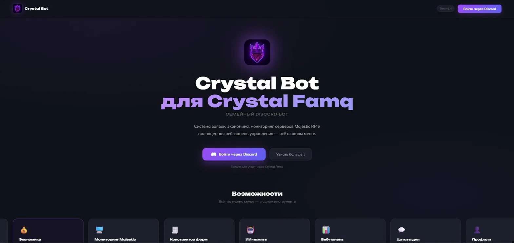
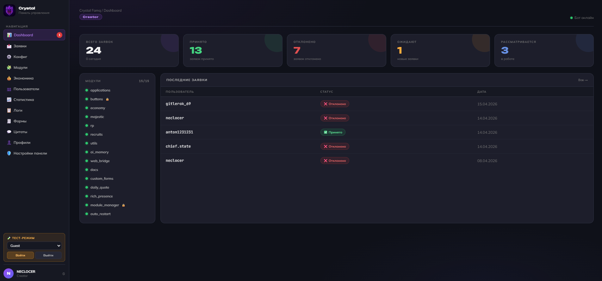
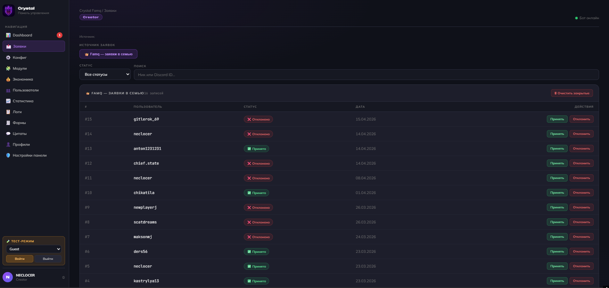
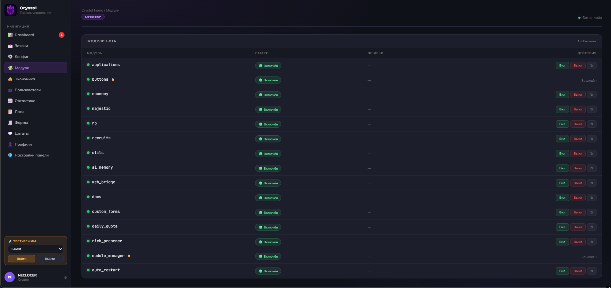
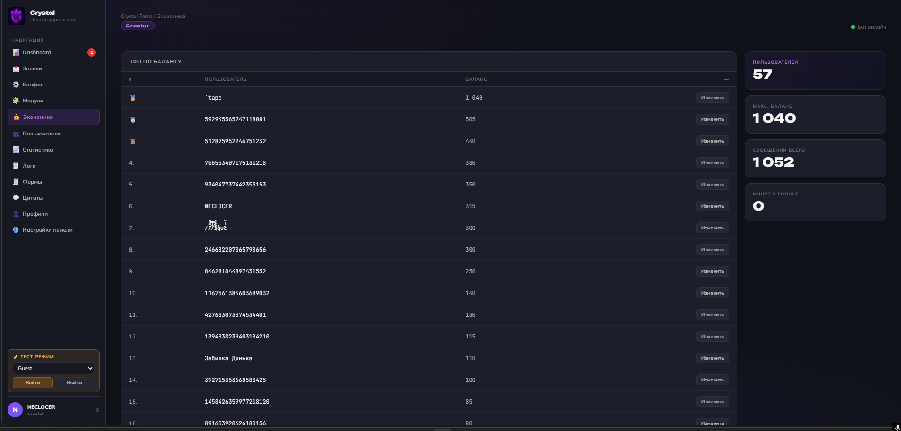
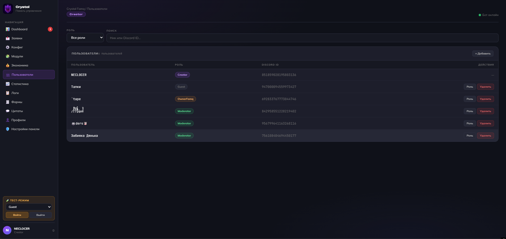
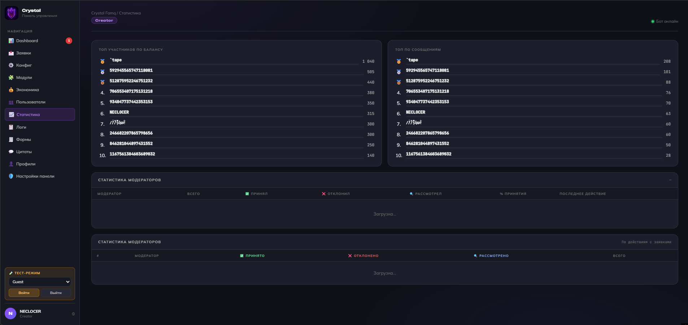
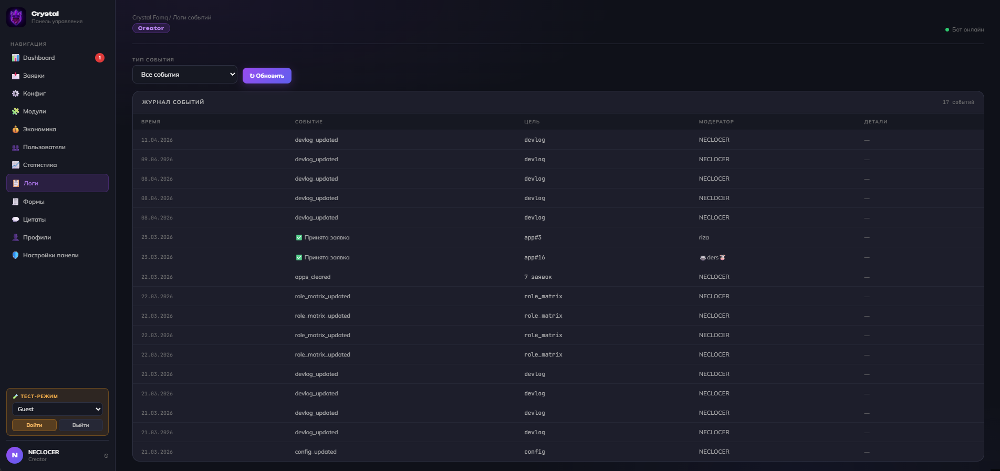
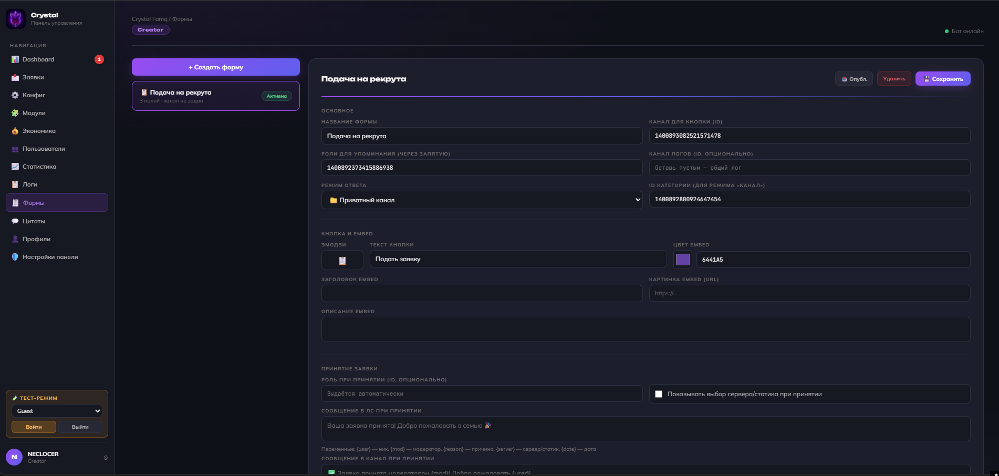
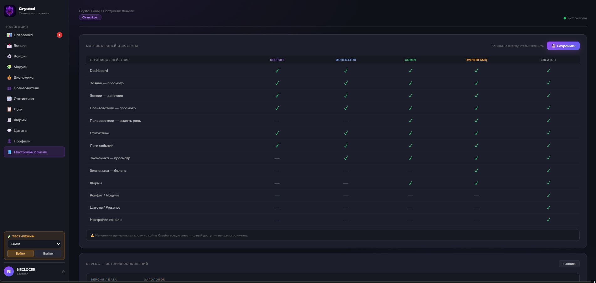

# Crystal Famq Bot

> Discord-бот + веб-панель управления для RP-сообществ Majestic RP  
> Разработан под заказ · NECLOCER DEV · 2025



---

## Стек

- **Bot:** Python 3.11, discord.py 2.4+
- **Backend:** FastAPI, aiosqlite, uvicorn
- **Frontend:** HTML, CSS, JavaScript (ванильный, без фреймворков)
- **БД:** SQLite
- **Деплой:** Aeza VPS, systemd

---

## Архитектура

Два независимых процесса на одном сервере:

```
bot.py          → слушает Discord, обрабатывает события
web/server.py   → FastAPI REST API + OAuth2 авторизация
data/           → файловая очередь команд (bridge bot ↔ panel)
```

Взаимодействие панели с ботом реализовано через файловую очередь —
панель пишет JSON-задание, бот читает каждые 10 сек и исполняет в Discord.

---

## Интеграция с Majestic RP API

Бот подключается к официальному API Majestic RP:

```
GET https://wiki.majestic-rp.ru/api/online
```

Ответ содержит онлайн по каждому серверу, пиковый онлайн за день и суммарный онлайн. Бот парсит эти данные и каждые 5 минут обновляет embed-сообщение в нужном канале Discord.

Особенности реализации:
- Фильтрация скрытых серверов (MCL)
- Если сообщение удалено — пересоздаётся автоматически

---

## Веб-панель

Авторизация через Discord OAuth2. Роли: Creator  Admin  Moderator  Recruit  Guest.

### Dashboard


### Заявки


### Модули бота


### Экономика


### Пользователи панели


### Статистика


### Логи событий


### Конструктор форм


### Матрица ролей и доступа


---

## Функционал

- Система заявок с приватными каналами
- Конструктор форм
- Мониторинг серверов Majestic RP (обновление каждые 5 мин)
- Экономика (баллы за сообщения и голос)
- ИИ-память в каналах (Hugging Face)
- Горячая перезагрузка модулей без рестарта
- Ежедневные цитаты через ИИ
- Rich Presence бота (статус, активность)
- Матрица ролей с тонкой настройкой доступа
- История обновлений (DEVlog) прямо на сайте
- Профили участников со статистикой
- Веб-панель с OAuth2 и ролевой системой

---

## Структура

```
crystal-bot/
├── bot.py
├── config.json
├── web/
│   └── server.py
├── dashboard/
│   └── index.html
└── modules/
    ├── applications.py
    ├── economy.py
    ├── majestic.py
    ├── custom_forms.py
    ├── daily_quote.py
    ├── rich_presence.py
    ├── auto_restart.py
    └── ...
```

---

*Коммерческий проект. Исходный код закрыт.*  
*По вопросам сотрудничества: Telegram @neclocer*
